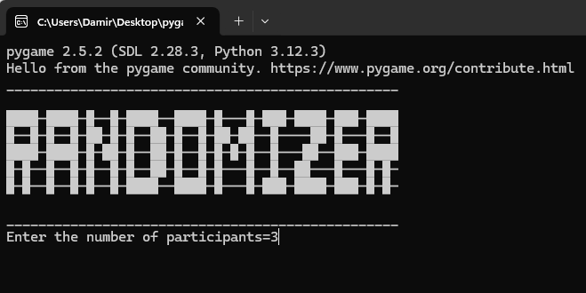
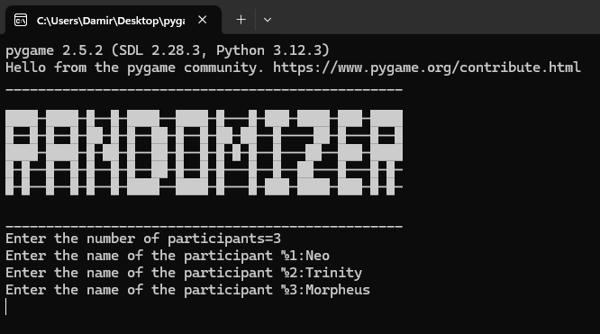
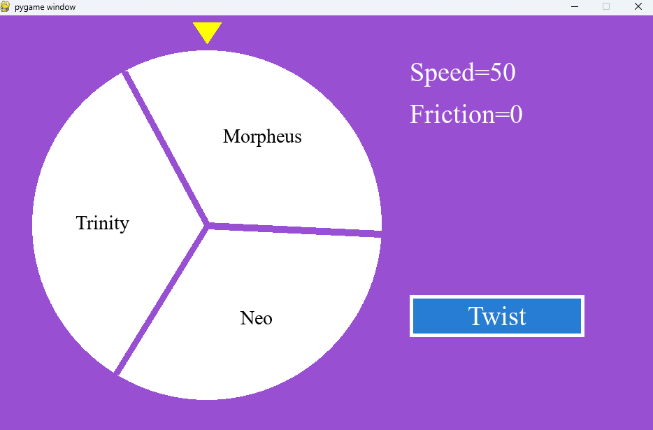
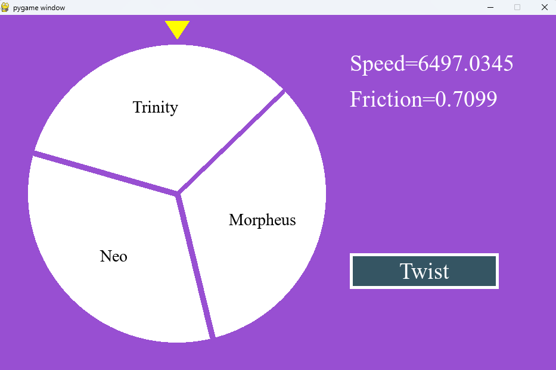
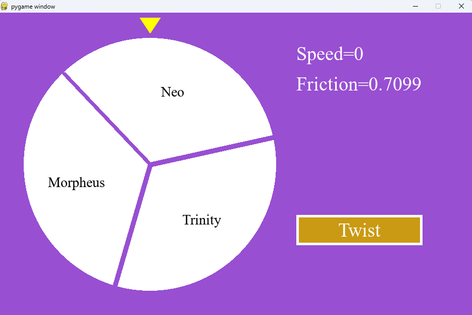

A simple randomizer in pygame.

After running the script, enter the number of participants.

Enter the names of the participants.

Click rotate, and then the selection process will start.

The speed and friction will be randomly selected.

In this case, Neo goes for a beer.

